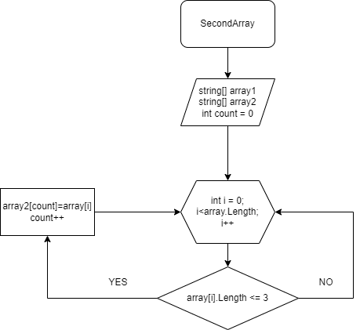

# Итоговая проверочная работа #

*Функция SecondArray*

 Показываем два массива: массив 1 и массив 2. Используем метод, в котором цикл равен длине массива, с условием проверки цикла (<= 3), если "ДА" элемент массива 1 заносится в  счетчик "count" элемента массива 2. Переменная "сount" увеличивается на 1 и возращается к циклу (for) в котором i увеличивается на 1. 

*Футкция PrintArray*

Печатает полученный в *SecondArray*  массив.

Далее задаем массив и пишем наши *Функции*.